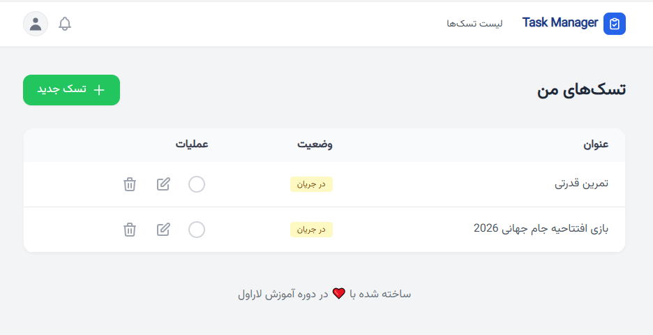
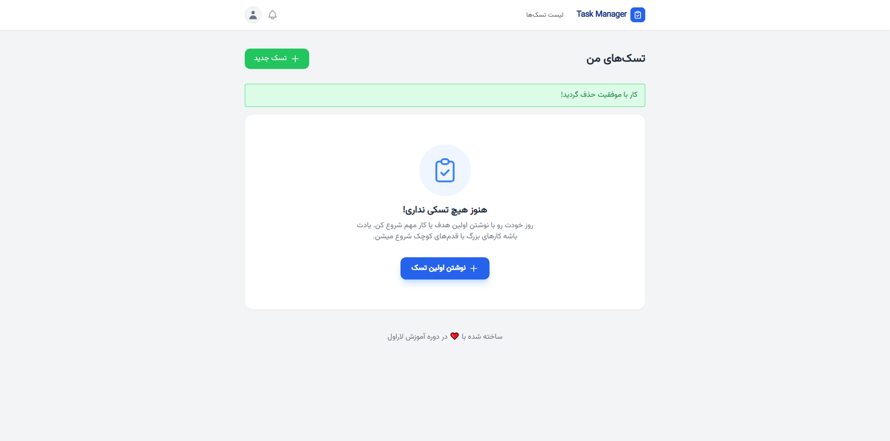

# 🚀 Task Manager Pro - Laravel 11

یک سیستم مدیریت تسک مدرن و بهینه که با معماری **Service-Repository** طراحی شده است. این پروژه برای نمایش توانایی‌های فنی در کار با لاراول، دیتابیس و رابط کاربری مدرن ساخته شده است.

## 🖼 نمای پروژه

  

---

## ✨ ویژگی‌های برجسته
- **معماری حرفه‌ای:** استفاده از الگوی Service-Repository برای جداسازی منطق برنامه از کنترلر.
- **رابط کاربری مدرن:** طراحی شده با Tailwind CSS و آیکون‌های Heroicons.
- **سیستم مدیریت تسک:** قابلیت ایجاد، ویرایش، حذف و تغییر وضعیت تسک‌ها (Pending/Completed).
- **UX بهبود یافته:** حذف خودکار پیام‌های موفقیت با JavaScript و نمایش وضعیت Empty State.
- **امنیت:** استفاده از Eloquent برای جلوگیری از SQL Injection و مدیریت امنیت فایل‌های حساس با Git.

## 🛠 تکنولوژی‌های استفاده شده
- **Backend:** PHP 8.2+ / Laravel 11
- **Frontend:** Blade, Tailwind CSS, Alpine.js
- **Database:** MySQL
- **Tools:** Git, Composer, Vite

## 📸 گالری تصاویر
| ویرایش تسک | وضعیت خالی |
|---|---|
|  |  |

## 🚀 راه اندازی پروژه
1. کلون کردن مخزن:
`git clone git@github.com:sajad-webdev/laravel-task-manager.git`
2. نصب وابستگی‌ها:
`composer install` و `npm install && npm run dev`
3. تنظیمات محیطی:
`cp .env.example .env` (سپس تنظیمات دیتابیس خود را وارد کنید)
4. اجرای Migration:
`php artisan migrate`

## ⚖️ لایسنس
این پروژه تحت لایسنس **MIT** منتشر شده است.
